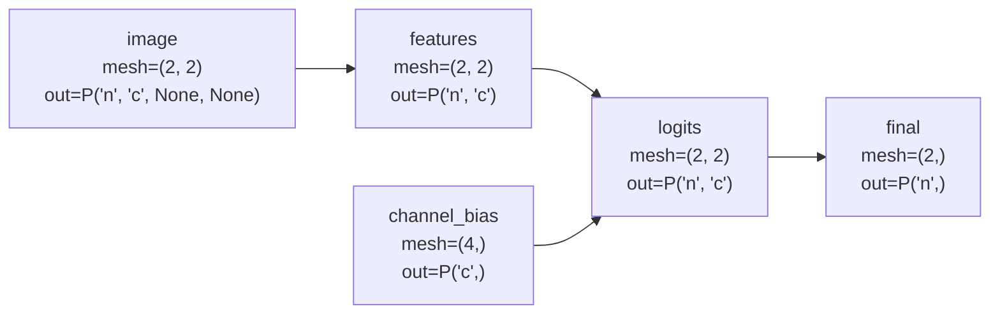

<h1 align="center">stak</h1>

`stak` is a small set of utilities for evaluating a hierarchy of JAX functions
as a directed acyclic graph where each node owns its own device mesh and
sharding specs.

The idea is to separate model building and device layouts, similar to how the `equinox` package allows expressing ML models on single elements of a batch.

Each `RandomVariableEntry` declares:

- the node name and dependencies,
- the function to run for that node,
- the value shape, including whether it has a leading sample axis,
- the devices and mesh axes used by that node,
- the input, output, and dependency `PartitionSpec`s.

`compile_hierarchy` topologically sorts the graph, builds a `jax.shard_map` for
each node, and records the sharding metadata needed by downstream nodes.
`hierarchy_model` then evaluates the graph in order. Source nodes consume
external inputs, derived nodes consume a dictionary of parent values, and parent
values are resharded onto the child node's mesh before the child function runs.

## Channels Example

The channel example in `examples/dag_test_channels.py` demonstrates a graph that
uses both a sample axis, `n`, and a channel axis, `c`.

The source `image` value has shape `[B, C, H, W]` and is sharded over a two-axis
mesh with `P("n", "c", None, None)`. A separate unbatched `channel_bias` source
has shape `[C]` and is sharded over the channel axis with `P("c")`.

The derived nodes then move through a small image-processing pipeline:

- `features` averages each image over height and width, producing `[B, C]`.
- `logits` adds the channel bias to those features while preserving `P("n", "c")`.
- `final` averages over channels, producing one score per sample with `P("n")`.



The useful bit is that `stak` lets each node describe the layout it wants, while
the evaluator handles the dependency handoff. For example, `final` receives
`logits` with dependency resources `("n", None)`, so the channel dimension is
replicated for the final reduction even though `logits` was originally produced
with channel sharding.

Run the example with:

```bash
uv run python examples/dag_test_channels.py
```
