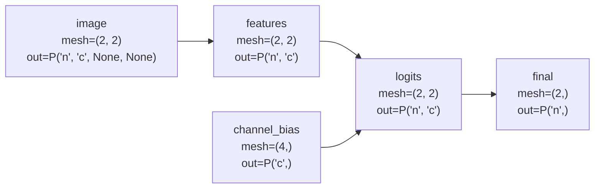

```mermaid
flowchart LR
    image["image<br/>mesh=(2, 2)<br/>out=P('n', 'c', None, None)"]
    channel_bias["channel_bias<br/>mesh=(4,)<br/>out=P('c',)"]
    features["features<br/>mesh=(2, 2)<br/>out=P('n', 'c')"]
    logits["logits<br/>mesh=(2, 2)<br/>out=P('n', 'c')"]
    final["final<br/>mesh=(2,)<br/>out=P('n',)"]
    image --> features
    features --> logits
    channel_bias --> logits
    logits --> final
```
